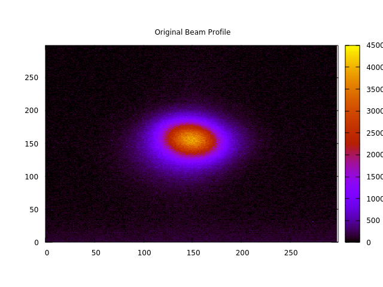
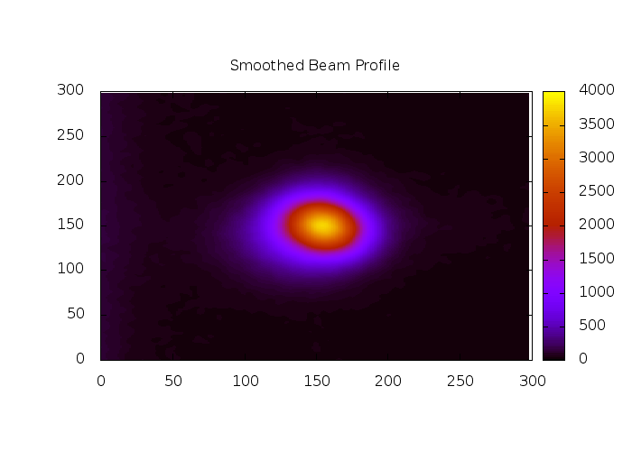

# Practice using GSL for Gaussin Fitting
There's a Makefile which will create the binary from the ascii file `data.csv`
and then runs the GSL steps.

## Input Test Data
Ascii data `data.csv` comes from `caget channel_name`.
The CPP program `create_binary_data.cpp` converts the ascii data into a binary file
`data.bin`.

## GSL
GSL is then used to read the binary data and  perform the following steps:

1. 2D Gaussian smoothing
	1. kernel size = 5
	1. alpha = 0.5
1. Aggregate cols
	1. Using the mean of the axes 0 and then 1
1. Fit Gaussian curve to the `mean_x` and `mean_y`

### GSL Example Page
https://www.gnu.org/software/gsl/doc/html/filter.html

# Viewing the Beam Profile
## Original Beam Profile

## Smoothed Beam Profile
To get a good fast fit, I propose firt smoothing the 2D beam profile image
with gaussian kernel.

## Fit Params
The fit is performed on the two single dimension reductions (average) of the
2D image.

